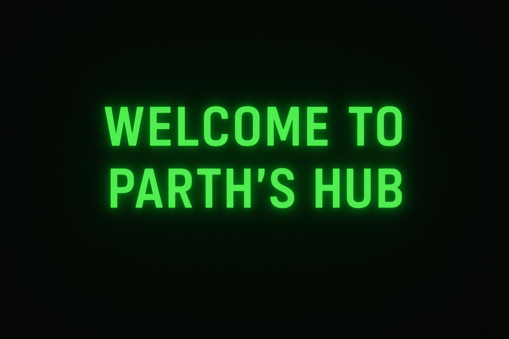

<p align="center">
  
</p>

<h1 align="center">
  <span style="color:#39ff14;">Parth Parmar</span> 👨‍💻
</h1>

<p align="center">
    
  <b style="color:#39ff14;">Full-Stack Developer • AI Explorer • Builder</b>  
    
</p>

---

### 🕹️ About Me

```diff
+ 👨‍💻 Software Engineer passionate about AI, automation, and scaling systems.
+ 🚀 Building projects that blend backend engineering with modern AI.
+ 🌐 Portfolio: [parth-parmar.vercel.app](https://parth-parmar.vercel.app/)
- Always hacking, learning, and pushing limits...
```

---

### ⚡ Tech Arsenal

<p align="center">
  
  
  
  
  
  
</p>

---

### 🖥️ GitHub Analytics

<p align="center">
  
  
</p>

<p align="center">
  
</p>

---

### 🧑‍💻 Featured Projects

```diff
+ 🔐 [Financial-Bot](https://github.com/parthparmar0816/Financial-Bot) → AI-powered financial assistant.
+ 📊 [Rules Engine](https://github.com/parthparmar0816) → Dynamic tax/staff rule automation.
+ 📡 More on my profile → [Repositories](https://github.com/parthparmar0816?tab=repositories)
```

---

### ⌨️ Fun Zone

<p align="center">
  
</p>

---

### 📡 Connect with Me

<p align="center">
  <a href="https://parth-parmar.vercel.app/"></a>
  <a href="https://www.linkedin.com/in/parthparmar0816/"></a>
  <a href="mailto:parth.parmar1616@gmail.com"></a>
</p>

---

<p align="center">
  
  <br/>
  <i style="color:#39ff14;">“Talk is cheap. Show me the code.”</i>
</p>
